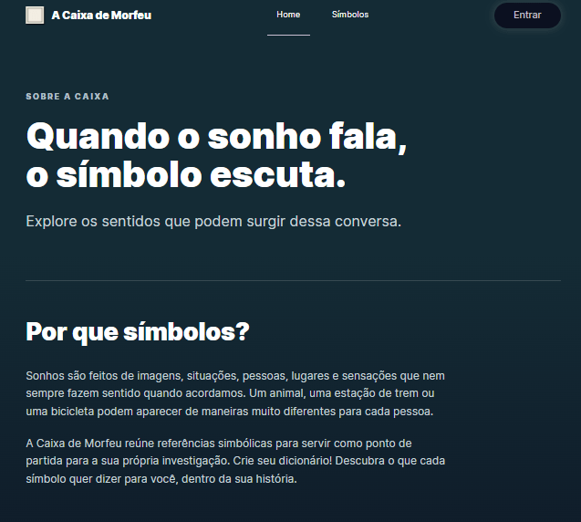
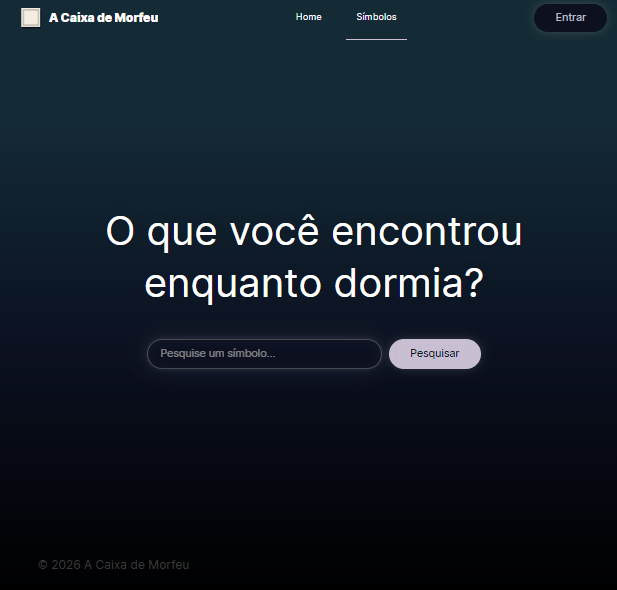

# A Caixa de Morfeu

Uma ferramenta para explorar o simbolismo dos sonhos.

**A Caixa de Morfeu** permite pesquisar símbolos encontrados durante os sonhos e consultar seus significados a partir de diferentes perspectivas simbólicas.

O projeto está sendo desenvolvido como trabalho final de um curso de desenvolvimento web full-stack, utilizando React no front-end e, posteriormente, uma API própria no back-end.

## Funcionalidades

Atualmente, a aplicação permite:

- pesquisar um símbolo relacionado a um sonho
- consultar informações simbólicas sobre o termo pesquisado
- utilizar a aplicação em diferentes tamanhos de tela

## Tecnologias

### Front-end

- React

- Vite
- React Router
- JavaScript
- HTML5
- CSS3

### APIs

A aplicação utiliza:

- **Asterwise API** para consulta de símbolos e seus significados;
- **MyMemory API** para tradução dos termos e conteúdos retornados pela API para português.

As requisições à Asterwise são realizadas através de um proxy configurado no Vite.

## Como executar o projeto

### Pré-requisitos

Para executar o projeto localmente, é necessário ter instalado:

- Node.js
- npm
- Git

### Instalação

npm install
npm run dev

## Próximos passos

O projeto terá uma segunda etapa de desenvolvimento, com a criação do back-end e integração de funcionalidades para usuários autenticados.

Entre as funcionalidades planejadas estão:

- cadastro e login de usuários;
- armazenamento de símbolos pesquisados;
- registro da data do sonho;
- área **Meus Sonhos**.

## Telas

